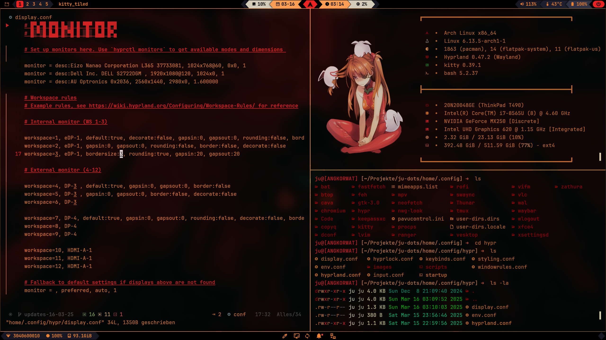
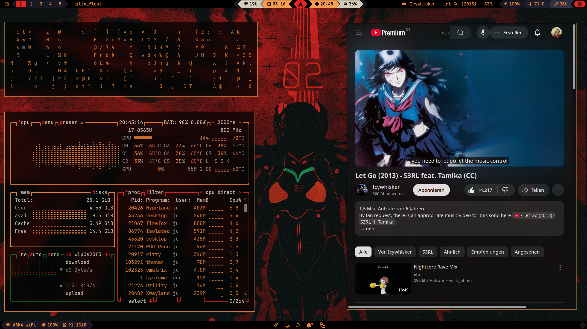
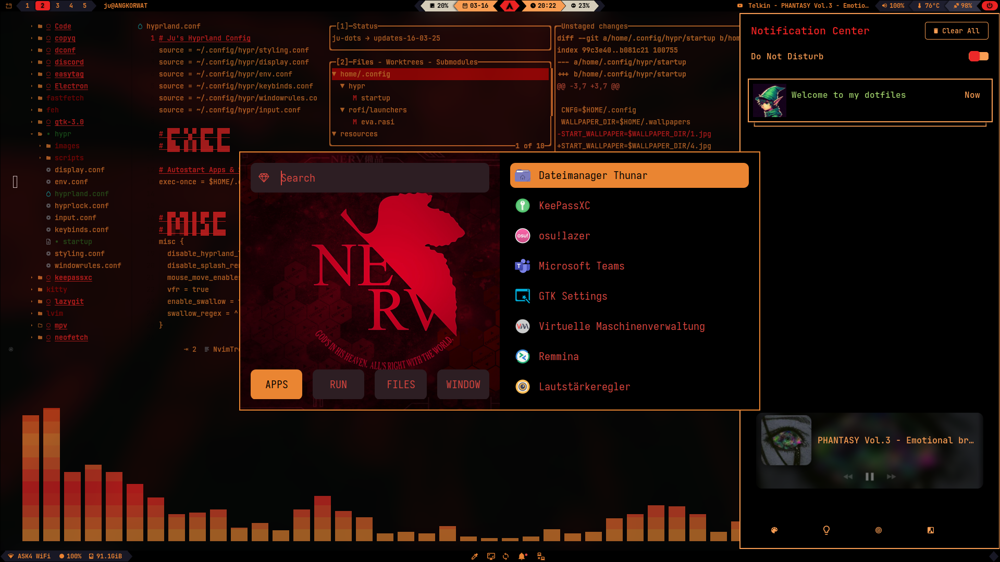
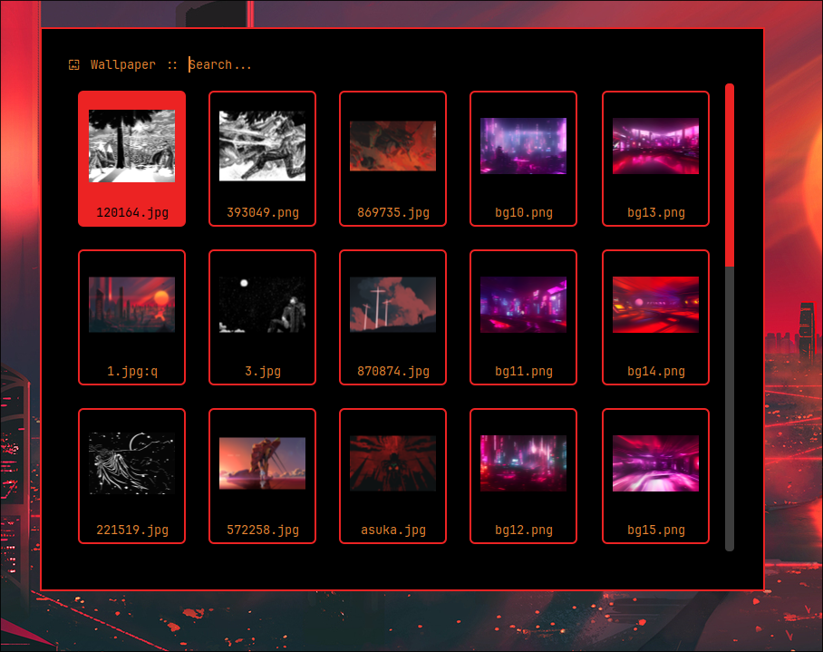
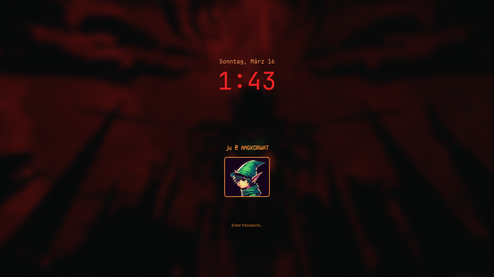

# Ju's Dotfiles

### These are the configuration files for my Arch + Hyprland setup






## Installation
> [!WARNING]  
> This repository should only be used as reference or inspiration, and is not expected to just work with any setup when cloned. Proceed if you know what you are doing.

> **Note**: This configuration has been designed for Arch Linux (and derivatives). Using it on other distributions may require changes.


Clone the repo, navigate to the directory and install the needed packages using pacman
```sh
git clone https://github.com/jusuhero/dots.git
cd dots
sudo pacman -S - $(< packs)
```
Also there are some AUR packages I am using. Install with an AUR Helper, for example paru or yay
```sh
paru -S hyprshade-git bibata-cursor-theme waybar-cava

```
Use rsync to copy configs from the repo to your home directory. Existing files will be backed up with a .bak suffix:
```bash
rsync -avh --backup --suffix=.bak home/ ~/
```

**Optional:** If you like to use greetd as your login manager, enable the service
```bash
sudo systemctl enable greetd
```
and in `/etc/greetd/config.toml` change the command line to
```sh
command = "tuigreet --time --cmd 'uwsm start Hyprland'"
```

Log out and back in and changes should be active.

## Keybinds

> [!NOTE]
> By default, the MOD (or $mainMod) key is SUPER (Windows Key)

### Terminals

<kbd>CTRL</kbd> + <kbd>ALT</kbd> + <kbd>T</kbd> = Floating centered terminal

<kbd>CTRL</kbd> + <kbd>ALT</kbd> + <kbd>RETURN</kbd> = Fullscreen terminal with big font size

<kbd>MOD</kbd> + <kbd>T</kbd> = Floating centered terminal

<kbd>MOD</kbd> + <kbd>RETURN</kbd> = Tiled kitty Terminal

### Basic Stuff

<kbd>MOD</kbd> + <kbd>Q</kbd> = Kill active window

<kbd>MOD</kbd> + <kbd>E</kbd> = Thunar (File Explorer)

<kbd>MOD</kbd> + <kbd>S</kbd> = toggle floating

<kbd>MOD</kbd> + <kbd>F</kbd> = toggle fullscreen

<kbd>MOD</kbd> + <kbd>D</kbd> = Vesktop (Discord)

<kbd>MOD</kbd> + <kbd>B</kbd> = Firefox

<kbd>MOD</kbd> + <<kbd>SHIFT</kbd> + kbd>B</kbd> = Chromium

<kbd>MOD</kbd> + <kbd>R</kbd> = Ranger

<kbd>MOD</kbd> + <kbd>H</kbd> = Launch (Top) Waybar

<kbd>MOD</kbd> + <kbd>SHIFT</kbd> + <kbd>H</kbd> = Launch (Bottom) Waybar

<kbd>MOD</kbd> + <kbd>L</kbd> = Lock screen

### Move

<kbd>MOD</kbd> + left,right,up,down = move focus between windows

<kbd>MOD</kbd> + <kbd>1</kbd> - <kbd>9</kbd> = Switch to workspace 

<kbd>ALT</kbd> + <kbd>1</kbd> - <kbd>9</kbd> = Move focused window to workspace 

### Exit

<kbd>MOD</kbd> + <kbd>Shift</kbd> + <kbd>Q</kbd> = Kill Hyprland session

For more keybinds please look directly into `dots/.config/hypr/keybinds.conf` because I just outlined the most important for me 

## Programs

### waybar
There are two bars available. Press <kbd>MOD</kbd> + <kbd>H</kbd> for the main bar at the top, press <kbd>MOD</kbd> + <kbd>SHIFT</kbd> + <kbd>H</kbd> for the bottom bar.
The top waybar is launched on start on Hyprland (see startup script)

I used an earlier version of Mecha Bar by Sejjy as a base (https://github.com/Sejjy/MechaBar), which is a really awesome waybar theme. I have just changed some things according to my liking.
The package used is waybar-cava (built with cava support) from AUR instead of normal waybar 

### Rofi 
Application Launcher. Press <kbd>MOD</kbd> + <kbd>SPACE</kbd> to select your applications to launch. There are two launchers available in `~/.config/rofi/launchers/`


<kbd>MOD</kbd> + <kbd>W</kbd> launches the wallpaper selector. You can select any wallpaper in `~/.wallpapers/` 



### Fish Shell
I have recently started using the fish shell and quite like it so far.
I'm planning on wrapping most scripts this setup uses (hyprland, waybar, utility etc.) into fish functions that can be found in `.config/fish/functions/`

### Feh 
This is a simple image viewer. `feh .` can be used to display images in the current folder in feh. It is integrated as default app for images in Thunar and vifm.  

### Pywal
This is what I use for theming/colors. There is only one theme in `~/.config/wal/colorschemes/` which I use, but it is possible to change various colors 
using `wal -i image.png`. The default theme is loaded upon startup.

### Firefox 
I use the ShyFox Theme. (https://github.com/Naezr/ShyFox) Clone the repo, install as described and also install the addons Sideberry, Userchrome Toggle Extended & Pywalfox.

Pywalfox is used for styling firefox in pywal colors, which needs to be installed first `paru -S python-pywalfox` and then also downloaded as firefox addon - search Pywalfox in Mozilla Store. 

### Tmux 
Allows splitting panes and much more. Install Tmux Plugin Manager (tpm) first: 
```
git clone https://github.com/tmux-plugins/tpm ~/.tmux/plugins/tpm
```
Then copy contents of `dots/.config/tmux` into `~/.config/tmux/` 

### Neovim 
<del>I use LunarVim, and have added configuration for different LSPs, and installed some additional cool plugins. 
See (https://www.lunarvim.org/de/docs/installation) for installation guidance and after that copy 'dots/.config/lvim/*' into '~/.config/lvim/'
I would recommend setting an alias in zsh or bashrc like this: `alias vim='~/.local/bin/lvim'` </del>

Probably my favourite plugin is MarkdownPreview which allows previewing Markdown Files in the Browser, neatly formatted and auto-updating.

Since LunarVim has stopped working with newer neovim versions and hasn't been updated since a year I switched to LazyVim (https://www.lazyvim.org/), but haven't configured it yet. My old LunarVim config will still be kept in this repo though.

### Helix
Recently I started using helix as my editor because I feel like it doesn't require as much maintenance as neovim. It also has many helpful plugins preinstalled with sane defaults, making configuration needs slim. The configuration contains some base options, as well as language servers for python, javascript, typescript etc.
Make sure the needed language servers are installed:
```bash
sudo pacman -S --needed ruff typescript-language-server pyright prettier vscode-html-languageserver marksman
```
For Markdown Preview in browser (mpls) install it with go
```bash
go install github.com/mhersson/mpls@latest
```

### vifm 
Terminal file explorer. I like it very much. It is configured to show a preview of the file contents at the right side.
It also works with image previews. Upon pressing  <kbd>Right arrow</kbd> the image is then opened in feh in fullscreen, allowing cycling through the images.

### Swaync (Notification Client)
This is the notification client. The daemon gets initialized in the hyprland startup script. The notification GUI can be opened by clicking on the bell icon in the bottom waybar or by using <kbd>MOD</kbd> + <kbd>N</kbd>

### Hyprshade 
Allows you to apply color filters. They can be activated by clicking buttons in swaync-client. I sometimes use the blue-light filter but the other ones are just for show off.

### Hyprlock 



Locks the screen when pressing <kbd>MOD</kbd> + <kbd>L</kbd>. Find confuration in `~/.config/hypr/hyprlock.conf`

### Hyprpicker 
This allows you to select a color on the screen and copy the hex code into the clipboard. It can be selected via <kbd>MOD</kbd> + <kbd>X</kbd> keybind or via clicking the pipette icon in the bottom waybar 

### Screenshot
Screenshot/Screencapture works using wf-recorder, grim and slurp. 
<kbd>MOD</kbd> + <kbd>v</kbd> will create a screencapture with audio. Specify the video folder it should upload to inside the script in Hyprland/script folder.

<kbd>MOD</kbd> + <kbd>SHIFT</kbd> + <kbd>v</kbd> will end the recording and kill wf-recorder.

<kbd>Print</kbd> will save a screenshot of your active monitor to the clipboard 

<kbd>MOD</kbd> + <kbd>p</kbd> Will allow you to select an area and copy a screenshot of this to the clipboard.

<kbd>MOD</kbd> + <kbd>SHIFT</kbd> + <kbd>p</kbd> Will allow you to select and area and copy a screenshot of this to a file.

<kbd>MOD</kbd> + <kbd>SHIFT</kbd> + <kbd>s</kbd> Swappy: A windows like snipping tool that lets you annotate screenshots before you save them to file or clipboard. 

### Hyprpaper (Wallpaper)

The wallpapers are in ~/.wallpapers by default - this is set in ~/.config/hypr/env.conf. The wallpapers can be switched by using the rofi menu <kbd>MOD</kbd> + <kbd>W</kbd> or by clicking the Switch Wallpaper Icon in the bottom waybar.
